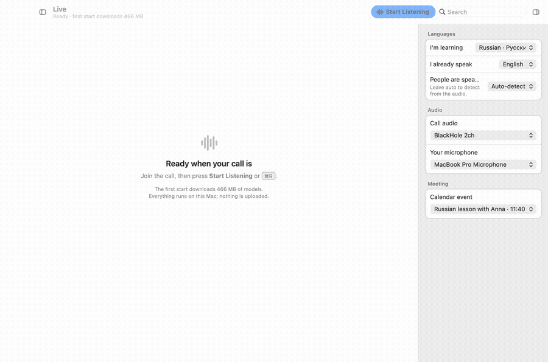

# LearnLive

Live translation, speaker detection and grammar coaching for video calls — one binary, fully offline.

Join a Google Meet / Zoom / Teams call, press **Start listening**, and every utterance shows up as:

- who said it (speakers are told apart by voice; your own mic is always "You")
- the sentence in the language you're learning, in large serif type, with each word underlined by part of speech¹
- the gloss in your native language underneath
- hover any word for lemma, part of speech and case/tense¹; **Hear** / **Slower** / **Replay original** per line
- optionally, the translation read aloud while the call audio is ducked underneath it
- lines are provisional while someone is still talking, then rewritten in place once the sentence lands — words that moved or changed form flash briefly, so free-word-order languages like Russian don't leave you with a wrong first draft
- each line shows arrival time and a live "3 min ago"; scrolling up pauses auto-follow, with a "N new · back to now" button to return

Works in either direction: speech in your learning language is translated *to* your native language so you can follow; anything else (including what you say) is translated *into* the learning language so you see how you could have said it. If Whisper misidentifies the speaker's language, override it per source from the session setup panel.

¹ POS underlining and hover grammar cards need a tagger model that currently has no working source (see [Known debt #1](ARCHITECTURE.md#known-debt-in-order-of-pain)) — plain text and no cards until one is hosted.

A native-feeling Mac app: split-view sidebar (live + past meetings), unified toolbar, an inspector for per-session settings, and a Settings window (⌘,) for the rest — all in system colours, following light/dark/Increase Contrast.



*(Rendered with `just ui-preview`, the WKWebView harness described under [Build](#build) — no models or call needed.)*

## Meetings, people and history

- **Calendar link.** On Start, LearnLive looks at your calendar (macOS EventKit, read‑only, permission prompt on first use) for a meeting in progress or about to start and attaches the session to it. Attach later from the Meeting panel if it guessed wrong or you started early.
- **Speakers → people.** With an invite linked, each detected speaker gets a dropdown of attendees. Pick "Anna" and every line from that voice is relabelled, now and in history.
- **Remembered voices** (off by default, Settings → Privacy). When on, the voice of anyone you've *named* is averaged into a local voiceprint and they're recognised from their first sentence next time. Stored only in the local SQLite file; turning it off deletes all of them; per‑person forget is a command away.
- **History.** Every finalised sentence is written to `learnlive.sqlite` in the app data dir, with FTS5 search across all meetings in both languages ("книгу", "book", prefix*). Open any meeting and you get the same reading surface with hover cards and clip replay.

Tauri has no calendar plugin; `src-tauri/src/calendar.rs` is a small `objc2` bridge to EventKit and is macOS‑only for now (Windows/Linux would need the Google Calendar API).

## Languages

English, Russian, Ukrainian, Spanish, French, German, Italian, Portuguese, Polish, Turkish, Arabic, Chinese, Japanese, Korean, Hindi, Dutch. Any pair, any direction. Adding one is a row in `src-tauri/src/engine/languages.rs` (+ a Piper voice in `models.rs` if you want it spoken).

## How it's built

Everything is Rust inside a Tauri 2 app. No Python, no separate server.

```
cpal (BlackHole, mic, …)
  └─ audio::mixer      per-source gain / mute / duck, resample → 16 kHz mono, 20 ms frames
       └─ engine::vad        Silero VAD → utterances                       (sherpa-onnx)
            ├─ engine::asr        Whisper, multilingual + language ID       (sherpa-onnx)
            ├─ engine::diarize    ERes2Net speaker embeddings + online clustering (sherpa-onnx)
            ├─ engine::translate  NLLB-200 distilled 600M, int8             (ort / ONNX Runtime)
            ├─ engine::grammar    XLM-R Universal Dependencies POS tagger   (ort)
            └─ engine::tts        Piper voices, ducked over the call         (sherpa-onnx)
                 └─ Tauri events → React transcript
```

The binary is ~15 MB. Models (~1.2 GB for a typical setup, more for the large Whisper) are downloaded into the app data dir on first run for the languages you pick, with a progress list in the UI. Turn on the `bundled-models` cargo feature if you'd rather ship them inside the app.

## Build

```bash
devbox shell   # Rust, Node, just, ffmpeg from devbox.json
just setup     # npm ci + tauri CLI
just dev       # hot reload
just build     # → src-tauri/target/release/bundle/{macos,dmg}/
```

Without devbox: Rust stable, Node 20, `cargo install tauri-cli --version "^2"`, then the `npm run tauri …` scripts. See CONTRIBUTING.md for the release flow (conventional commits → release-please).

First `cargo build` pulls prebuilt sherpa-onnx and ONNX Runtime binaries (the `download-binaries` features), so it needs network once.

`just ui-preview` renders the UI's main states to `out/ui-*.png` via a bare WKWebView with the Tauri bridge mocked — useful for checking a UI change without models, audio devices or screen-recording permission. See `scripts/ui-preview/README.md`.

### How revision works

`pipeline.rs` keeps one *open* sentence per session. A new VAD chunk **continues** it when it's the same speaker, arrived within 1.5 s, the previous transcript didn't end in terminal punctuation, and the total is under 20 s. Continuation re-runs Whisper on the *merged audio* (not string-concat) and re-translates, emitting the same `id` with `final: false` and `revision + 1`. The sentence finalises on terminal punctuation, a speaker change, 1.8 s of idle, or the length cap; only then does TTS speak it and the clip get written. The UI upserts by id and diffs tokens against the previous revision.

### Getting call audio in (macOS)

1. Install [BlackHole 2ch](https://existential.audio/blackhole/).
2. Audio MIDI Setup → create a **Multi-Output Device** containing your headphones *and* BlackHole, set it as system output. You keep hearing the call; LearnLive captures the BlackHole leg.
3. In LearnLive, *Call audio* → BlackHole 2ch, *Your microphone* → your mic.

Windows: WASAPI loopback devices show up automatically. Linux: PulseAudio/PipeWire "Monitor of …" sources.

## Project layout

```
src/                       React UI (TypeScript)
  App.tsx                    window shell: sidebar | toolbar over (content | inspector)
  windows/Settings.tsx       the Settings window (⌘,), opened by the Rust shell
  components/shell/          Sidebar (live + past meetings), Toolbar, Inspector
  components/panels/         inspector panels: session setup, mixer, speakers, meeting, details
  components/views/          content: LiveView, MeetingView, SearchResults
  components/Transcript.tsx  the reading surface
  components/Word.tsx        hover card + pronunciation
  components/ui/             Button, Form (Group/Row), Switch, SearchField, Banner, Icon
  hooks/                     useSession, useTranscript, useHistory, useLayout, useMenu
  lib/api.ts                 typed wrapper over Tauri commands/events
  lib/prefs.ts               persisted config, shared with the Settings window
  styles/                    tokens (AppKit system colours), base, controls, shell, transcript
src-tauri/src/
  audio/                     capture, mixer, resample, playback, file_source
  calendar.rs                EventKit bridge (macOS) — no Tauri plugin exists for calendars
  db.rs                      SQLite: meetings, participants, segments + FTS5, voiceprints
  engine/                    asr, diarize, translate, grammar, tts, vad, languages
  pipeline.rs                session orchestration (audio thread + ML thread)
  models.rs                  manifest + downloader
  commands/                  Tauri command surface, one file per concern
  native.rs                  menu bar, window lifecycle, Settings window
```

## Testing

Three tiers, all in `.github/workflows/ci.yml` (macOS Apple Silicon runners):

| Tier | Command | Needs | When |
|---|---|---|---|
| Unit | `cargo test` + `npm test` | nothing | every push |
| Golden | `LEARNLIVE_MODELS=… cargo test --test golden -- --ignored` | models + fixtures | nightly, or PR label `golden` |
| Bundle | `npx tauri build --ci` | Rust + Node | every push |

**Unit** tests mock the engine traits and exercise the parts that are actually ours: mixer gain/mute/duck, resampler, the sentence-revision rules (`pipeline.rs` tests), the token diff and time helpers in the UI.

**Golden** tests run `pipeline::run_offline()` on a WAV and assert thresholds, not strings: WER < 0.25, correct language ID and you/them role per line, exactly one remote speaker id, the split-sentence fixture merged, timings within 1 s. Fixtures are *generated* from `fixtures/*.script.json` with the same Piper voices the app ships, so ground truth is exact and nothing private is in the repo:

```bash
cargo run --bin model-fetch -- --models .models --asr small --langs ru,en
cargo run --bin fixture-gen -- --models .models fixtures/ru-lesson.script.json fixtures/ru-lesson
LEARNLIVE_MODELS=.models cargo test --test golden -- --ignored --nocapture
```

**A real meeting recording works too.** Export it as WAV and write an `.expected.jsonl` by hand (see `fixtures/README.md`). Mono makes everything "remote"; a stereo file with you on the left and the call on the right also tests the role split. You can also run the *live* app against a file: pick a source id of `file:/path/to/call.wav` and it's fed in at real-time pace through the normal mixer.

See **ARCHITECTURE.md** for layers, data flow and step-by-step recipes for adding a language, an engine, a command or a UI panel.

## Status / roadmap

Compiles, runs and is responsive on macOS Apple Silicon, with the native split-view shell described above. Things I'd do next, in order:

1. Token-level streaming within an utterance.
2. Real morphology (see ARCHITECTURE.md).
3. KV-cache + beam search in the NLLB decoder.
4. Word alignment (source ↔ translation) for cross-highlighting on hover.
5. Flashcard export (Anki) from hovered words — history already has everything needed.
6. Per-person page: every sentence they've said to you, most-hovered words.

## License

MIT
